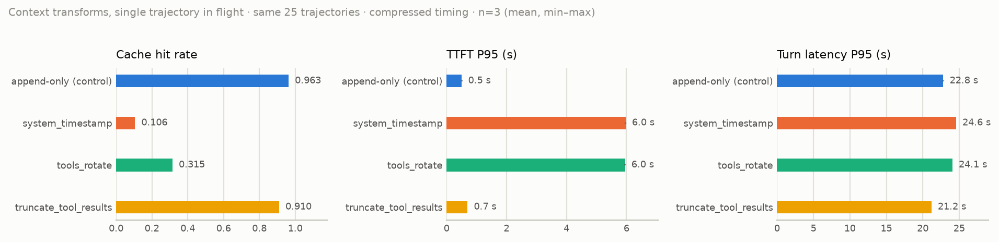
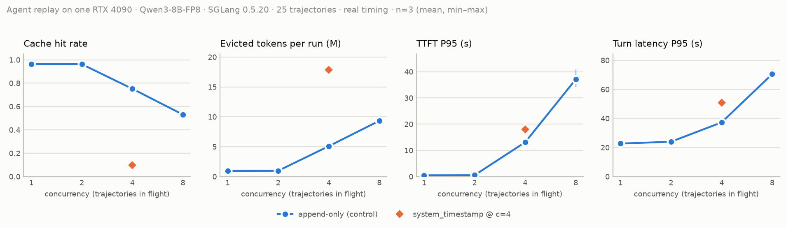
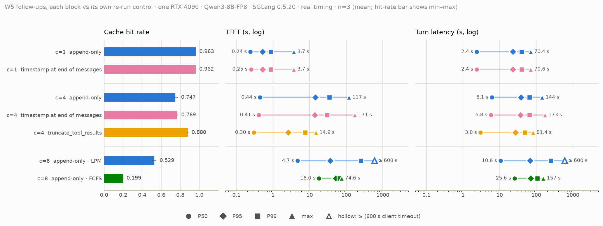

# agent-workload-lab

*English · [中文](README.zh-CN.md)*

How much does a coding agent's **context assembly** (on the harness side) change **prefix caching and scheduling** (on the LLM serving side)? This repository measures it: real [pi](https://github.com/badlogic/pi-mono) coding sessions are recorded once against a cloud model, then replayed as load against a local SGLang server at controlled concurrency. Each request's cache hits, TTFT and latency are logged, and queue depth and evictions are sampled from the server.

## TL;DR

A harness that writes the current time at the end of the system prompt:

- **breaks the cache** — radix-cache hit rate falls from **0.9633 to 0.1059**; append-only assembly restores 0.9633;
- **costs latency at one session** — turn P95 **+7.7 %**, TTFT P95 **+1078.7 %** (507 → 5971 ms);
- **costs much more under load** — with four sessions in flight, turn P95 **+36.7 %** and TTFT P50 **+1046 %**.

**The fix is to keep the clock out of the prefix, not away from the model.** The same timestamp placed at the end of the messages gives a hit rate of 0.9620. At one session latency is within noise of append-only, except a 9 ms (+3.8 %) rise in TTFT P50. At four sessions nothing gets worse: TTFT P50 is 8.1 % lower, run wall time 2.9 % shorter, and every other metric is within noise.

Setup for all numbers: one RTX 4090 · SGLang 0.5.20 · Qwen3-8B-FP8 · 25 recorded trajectories (837 requests per replay) · every configuration replayed 3× with variance reported. Sources: [`experiments/*/report.md`](experiments) and [`docs/findings.md`](docs/findings.md).

**Contents:** [How it works](#how-it-works) · [Why this repository matters](#why-this-repository-matters) · [Reading the numbers](#reading-the-numbers) · [Results](#results) · [Findings in detail](#findings-in-detail) · [Repository layout](#repository-layout) · [Reproducing](#reproducing) · [Scope and limitations](#scope-and-limitations)

## How it works

```
pi + extension/  ──record──▶  traces/*.jsonl  ──replay/──▶  SGLang on one GPU
                                   │                            │
                            analysis/profile           metrics/ + per-run artifact
                            (workload profile)         experiments/<name>/out/<run>/
                                                                │
                                                       analysis/report · analysis/plot
```

1. **Record.** A pi extension records every model request of a real coding session verbatim, with timings, tool durations and turn boundaries.
2. **Replay.** The replayer sends the recorded requests to a local SGLang server at a chosen concurrency and timing mode. It reproduces the token sequence and timing, not the model's behaviour.
3. **Measure.** Cache hits, TTFT and latency are logged per request; queue depth, evictions and retractions are sampled from SGLang's `/metrics`. Every run records an environment fingerprint.
4. **Change one thing.** A context transform (or a concurrency level, or a scheduler) is applied and the replay repeated. The comparison report marks the result invalid if the two groups differ in anything else.

## Why this repository matters

That dynamic content in the system prompt breaks prefix caching is not news — every prompt-caching guide says to put static content first. What this repository adds is **what it costs under load, and why**:

- **Cache cost depends on concurrency; single-session benchmarks underestimate it.** The same timestamp costs +7.7 % turn P95 with one session in flight and +36.7 % with four. The fix is free.
- **For agent workloads the KV pool is a session cache, and past its capacity more concurrency means less throughput.** Retraction is rare; pressure is absorbed by evicting idle sessions' prefixes. The cliff sits between 2 and 4 sessions, consistent with `sessions × context ≈ KV pool` (78 k tokens here). c=8 takes 16 % longer than c=4 for the same work, and 11 requests time out across its three runs. Capacity planning should be admission control by that product, not by compute.
- **Hit rate is a poor latency signal, and the same harness change can flip sign under load.** Truncating old tool results is a decode win at c=1 (hit rate slightly down) and a cache win at c=4 (hit 0.747 → 0.880, TTFT P95 −82 %). Context-management strategies have to be evaluated with concurrency.
- **The scheduler choice is a real trade-off, not a free fix.** Longest-prefix-match starves long sessions (repeated ≥ 600 s timeouts at c=8); FCFS removes the starvation (max TTFT ≤ 77 s) at the cost of hit rate 0.53 → 0.20 and 3.9× median TTFT.

Reusable beyond these numbers:

- a **record → replay pipeline** for real agent sessions, with an environment fingerprint on every run;
- a **GPU-free first gate**, `just estimate`, which renders every request through the real chat template and tokenizer. It matches the measured single-session hit rate within 0.0007 for every c=1 group except `tools_rotate` (estimate 0.108, measured 0.315);
- **comparison reports** that mark a comparison invalid when fingerprints differ or more than one variable changed, report Δ/noise, and keep timed-out requests as right-censored percentiles.

Negative results and corrections are kept in [`docs/experiments.md`](docs/experiments.md).

## Reading the numbers

| Term | Meaning |
|---|---|
| **c=N** | N recorded sessions replayed concurrently ("in flight"). |
| **cache hit** | Prefix-cache hit rate = cached prefill tokens / total prefill tokens, aggregated over requests (from `usage.prompt_tokens_details.cached_tokens`, SGLang `--enable-cache-report`). |
| **TTFT** | Request sent → first content token, including queueing. |
| **turn latency** | Request sent → stream finished. |
| **P50 / P95 / P99** | Tails are always reported as percentiles, never as a mean alone. Requests that hit the client timeout (600 s) stay in as right-censored lower bounds instead of being dropped ([decision](docs/decisions.md)). |
| **append-only** | The control: recorded requests replayed unchanged (identity transform). In the recorded trajectories every request keeps all of the previous request's messages, except after a context compaction. |
| **LPM / FCFS** | SGLang scheduling policies: longest-prefix-match (serve the request with the most cached prefix first) vs first-come-first-served. Every run uses LPM except the W5 FCFS group. |
| **queue non-empty** | Share of `/metrics` samples in which at least one request is waiting in SGLang's queue. |
| **wall** | Wall-clock time of one replay run (all 25 trajectories). |
| **within noise** | Δ/noise below 2×, where noise is the larger run-to-run standard deviation of the two groups. |
| **W3 / W4 / W5** | Project phases: context transforms at one session, concurrency sweep, follow-ups. |

Timing modes: the W3 transforms use *compressed* timing (each request is sent as soon as the previous one finishes, so tool and think time drop out); the W4 concurrency sweep uses the *real* recorded gaps, each capped at 30 s (`max_gap_s`). The two are never put in one table; at c=1 they agree within 1.7 % on every percentile. In W5, the c=1 groups use compressed timing and the c=4 / c=8 groups real timing.

Metric definitions are fixed for the whole project; any change is logged in [`docs/decisions.md`](docs/decisions.md).

## Results

### 1 · Context transforms at one session (W3)

Two harmless-looking transforms — a clock in the system prompt and a rotated tool list — destroy most of the cache. Truncating old tool output costs a little cache but makes turns faster.

<picture>
  <source media="(prefers-color-scheme: dark)" srcset="docs/figures/w3-transforms-dark.png">
  
</picture>

| transform (vs append-only control) | cache hit | TTFT P95 | turn latency P95 | prompt tokens |
|---|---|---|---|---|
| append-only (control) | 0.9633 | 507 ms | 22.8 s | 19.47 M |
| `system_timestamp` — clock at the end of the system prompt | **0.1059** | **5971 ms** (+1079 %) | 24.6 s (+7.7 %) | +0.1 % |
| `tools_rotate` — tool list rotated by one each request | 0.3150 | 5951 ms (+1075 %) | 24.1 s (+5.5 %) | ±0 |
| `truncate_tool_results` — old tool outputs clipped | 0.9102 | 695 ms (+37 %) | **21.2 s (−7.1 %)** | **−29.2 %** |

### 2 · Concurrency sweep with real inter-turn timing (W4)

From 1 to 2 sessions the hit rate and TTFT P95 barely move. Between 2 and 4 the sessions stop fitting in the cache and TTFT P95 jumps from 0.54 s to 13.1 s. At 8, the same work takes longer than at 4 and requests start timing out.

<picture>
  <source media="(prefers-color-scheme: dark)" srcset="docs/figures/w4-concurrency-dark.png">
  
</picture>

| sessions in flight | cache hit | TTFT P50 / P95 / P99 | turn latency P50 / P95 / P99 | evicted tokens / run | queue non-empty | timeouts (≥ 600 s) | wall |
|---|---|---|---|---|---|---|---|
| 1 | 0.9633 | 0.24 / 0.51 / 0.86 s | 2.4 / 22.7 / 39.8 s | 0.96 M | 0 % | 0 | 5958 s |
| 2 | 0.9626 | 0.26 / 0.54 / 1.6 s | 2.5 / 24.0 / 41.1 s | 0.97 M | 1.6 % | 0 | 3175 s |
| 4 | 0.7520 | 0.43 / **13.1** / 27.8 s | 6.1 / 37.3 / 64.8 s | 5.1 M | 49 % | 0 | 2792 s |
| 8 | 0.5309 | 4.7 / 37.1 / 223 s | 10.6 / 70.5 / 231 s | 9.3 M | 82 % | **11** | **3237 s** |
| 4 + `system_timestamp` | **0.0981** | 4.9 / 18.1 / 45.8 s | 10.9 / 51.0 / 92.8 s | **17.8 M** | 52 % | 0 | 4167 s |

Run-to-run CV is ≤ 4.8 % except c=2 TTFT P99 (22 %) and c=8 (TTFT P50/P95 6–9 %, P99 14–17 %).

### 3 · Follow-ups: the fix, truncation under load, and the scheduler (W5)

Moving the timestamp to the end of the messages recovers the cache. At c=4, truncation raises the hit rate and cuts TTFT P95 sharply. FCFS removes the timeouts but gives up most of the cache.

<picture>
  <source media="(prefers-color-scheme: dark)" srcset="docs/figures/w5-followups-dark.png">
  
</picture>

The replayer commit changed after W3/W4, so each W5 group is compared only with its own re-run control.

| experiment (vs its control) | cache hit | TTFT P50 / P95 / P99 | turn latency P50 / P95 / P99 | evicted tokens / run | timeouts (≥ 600 s) |
|---|---|---|---|---|---|
| c=1 append-only | 0.9633 | 0.24 / 0.52 / 0.87 s | 2.4 / 23.0 / 40.1 s | 0.96 M | 0 |
| c=1 timestamp at end of messages | 0.9620 | 0.25 / 0.52 / 0.86 s | 2.4 / 23.0 / 40.2 s | 0.98 M | 0 |
| c=4 append-only | 0.7467 | 0.44 / 14.3 / 34.4 s | 6.1 / 38.3 / 65.1 s | 5.18 M | 0 |
| c=4 timestamp at end of messages | 0.7688 | 0.41 / 13.7 / 29.8 s | 5.8 / 37.1 / 65.2 s | 4.75 M | 0 |
| c=4 `truncate_tool_results` | **0.8801** | 0.30 / **2.6** / 7.6 s | 3.0 / **27.0** / 48.5 s | 1.90 M | 0 |
| c=8 LPM scheduling | 0.5293 | 4.7 / 36.8 / 249 s | 10.6 / 68.2 / 251 s | 9.11 M | **2 / 5 / 2** |
| c=8 FCFS scheduling | **0.1991** | **18.0** / 51.4 / **66.4** s | 25.6 / 70.5 / **107** s | **15.90 M** | 0 |

At c=4 the timestamp-at-end group is within noise of append-only on hit rate, evictions, TTFT P95/P99 and every turn-latency percentile; TTFT P50 is 8.1 % lower (Δ/noise 2.2×) and run wall time 2.9 % shorter (3.7×). The eviction counts for c=1 control, c=8 LPM and c=8 FCFS come from 2 of 3 runs (the counter is absent right after a cold start). Timeouts for c=8 LPM are listed per run.

## Findings in detail

What the data shows that is not obvious. Full write-up with sources in [`docs/findings.md`](docs/findings.md).

1. **Past the cache-fitting concurrency, more concurrency reduces throughput.** Per run, c=8 takes 16 % longer wall time than c=4 for the same 25 trajectories and re-prefills 9.3 M evicted tokens (c=4: 5.1 M); across its three runs 11 requests time out.
2. **Memory pressure is absorbed almost entirely by prefix eviction; retraction is rare.** At c=4 at most 4 of 837 requests per run are retracted (0 at c=1 and c=2); retracted input tokens are 0.3–1.6 % of evicted tokens. Agent turns emit ~114 output tokens on ~21 k-token prompts, so the KV pool is full of *idle sessions' cached prefixes*, and the scheduler always has something to evict. At c ≥ 4, evicted tokens ≈ missed tokens: every eviction is a live session paying a cold prefill later. *(Corrected 2026-09-23: an earlier version said retraction never triggers — it read a gauge that resets every stats interval; see [decision](docs/decisions.md).)*
3. **Hit rate is a poor predictor of latency.** −5 points of hit rate came with −7 % turn P95 (truncation); −21 points came with +2488 % TTFT P95 (queueing); the next −65 points added only +38 %. Report miss *volume* and queue occupancy, not the hit percentage.
4. **Truncating old tool results helps through decode at one session and through the cache at four.** At c=1 TTFT got worse (+37 %) while turn P95 got better (−7 %) with identical output lengths. At c=4 the sign flips: hit rate 0.747 → 0.880, evictions −63 %, TTFT P95 −82 %, turn P95 −30 %. The change also cuts prompt tokens by 29 %, so this is less work as well as better caching.
5. **Run-to-run variance of the hit rate is itself a signal.** It is byte-identical across repeats at c=1 (std 0.0000) and drifts once eviction starts (0.0054 at c=4, 0.0155 at c=8).
6. **Harness changes can be evaluated offline for single-tenant hit rate, but not for their cost under concurrency.** A chat-template-aware longest-common-prefix predicted the direction of all three transforms; it cannot predict that the turn-P95 cost goes from +7.7 % to +36.7 % under load.
7. **Longest-prefix-match scheduling starves the requests with the least cacheable prefix; FCFS removes the starvation at the cost of the cache.** Under LPM at c=8, one long session times out on two consecutive turns in every run and the longest TTFT reaches 382–592 s. Under FCFS there are no timeouts, the longest TTFT is ≤ 77 s and TTFT P99 drops 73 %, but the hit rate falls from 0.53 to 0.20, evictions rise 75 % and median TTFT is 3.9× higher. *(Why the evicted session lands at the back of the queue is inferred.)*
8. *(inferred)* **The cliff sits where `concurrent sessions × context length` exceeds the KV pool** (78 k tokens here, ~25 k per session): fine at 2, broken at 4.

## Repository layout

| Directory | Contents |
|---|---|
| `extension/` | pi extension (TypeScript), observe-only: records every provider request verbatim with timing points, tool durations and turn boundaries. |
| `replay/` | Replayer: trajectory → normalised payload sequence → OpenAI-compatible endpoint, at a chosen concurrency and timing mode. Writes a self-describing artifact per run (config, fingerprint, plan, per-request log, metrics snapshots, summary). Also holds the context transforms under test. |
| `metrics/` | SGLang `/metrics` sampler. |
| `analysis/` | Workload profile, variance and comparison reports (flag mismatched fingerprints and more than one changed variable; a changed SGLang launch flag counts as a variable), figures, and `estimate`, the GPU-free first gate: hit rate = token-level longest common prefix with what the server has already seen. |
| `experiments/` | One directory per experiment: `config.yaml` plus the generated `report.md` / `compare-*.md` / `estimate.md`. Raw `out/` is not committed. |
| `scripts/` | Remote (AutoDL) setup, SGLang launch with fingerprinting, rsync, recording helpers. |
| `docs/` | [`findings.md`](docs/findings.md) conclusions · [`experiments.md`](docs/experiments.md) run log incl. negative results · [`decisions.md`](docs/decisions.md) metric definitions and trade-offs · [`recording.md`](docs/recording.md) / [`remote.md`](docs/remote.md) runbooks · [`figures/`](docs/figures) |

## Reproducing

Trajectories are **not** included: they contain source files of third-party repositories and model outputs. Their sha256 and shape (requests, prompt sizes, tool mix) are in [`experiments/profile/meta.json`](experiments/profile/meta.json) and [`profile.md`](experiments/profile/profile.md). To reproduce, record your own; everything else is scripted.

**Local** (no GPU):

```bash
uv sync && just test && just lint                 # Python 3.12 + uv; Node 20+ for extension tests
bash scripts/record.sh <repo> <case-name>         # record one trajectory with pi (your own model/API key)
just profile                                      # workload profile → experiments/profile/out/
just replay-dry w4-c4                             # build the replay plan without a server
just estimate w3-timestamp w3-control             # first gate: hit-rate estimate through the real chat template + tokenizer
```

**Remote** (one 24 GB GPU; the project used an AutoDL RTX 4090, see [`docs/remote.md`](docs/remote.md)):

```bash
cp scripts/remote.env.example scripts/remote.env  # SSH host/port
bash scripts/sync.sh --traces                     # code + traces → remote
ssh … 'bash scripts/setup.sh'                     # sglang 0.5.20 venv + Qwen3-8B-FP8 weights (idempotent)
ssh … 'bash scripts/serve.sh'                     # launches SGLang and writes the environment fingerprint
ssh … 'nohup bash scripts/run-batch.sh 3 w4-c1 w4-c2 w4-c4 w4-c8 w4-c4-timestamp &'
bash scripts/sync.sh --pull w4-c4                 # artifacts → local
just report w4-c4 && just compare w4-c4 w4-c1 && just plot
```

Every artifact carries an environment fingerprint (GPU, driver, SGLang version and launch args, model checksum, pi version, replayer commit, trace checksums); reports flag runs with different fingerprints as not comparable.

Cost: measured replay time across the 54 committed runs sums to ≈ 56 GPU-hours (`wall` rows in `experiments/*/report.md`), excluding setup, model load and warm-up.

## Scope and limitations

- **One of everything:** one GPU, one 8B model, one serving stack, one harness, 25 trajectories. Absolute numbers do not transfer. The qualitative findings depend on the workload shape (long prompts, short outputs, gaps between turns) and should transfer to similar workloads, but that is untested.
- **Inferred mechanisms:** findings marked *inferred* here and in [`docs/findings.md`](docs/findings.md) are consistent with the data but not directly observed.
- **No task success:** the replay model is a small local model, and only the token sequence and timing of the recorded sessions are reproduced. Whether the agent solves the task is deliberately out of scope.
- **Not done:** c=3, a longer client timeout at c=8, KV-cache FP8. See [`docs/later.md`](docs/later.md).

Working conventions for anyone (human or agent) contributing are in [CLAUDE.md](CLAUDE.md). License: [MIT](LICENSE).
