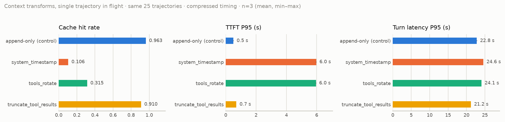
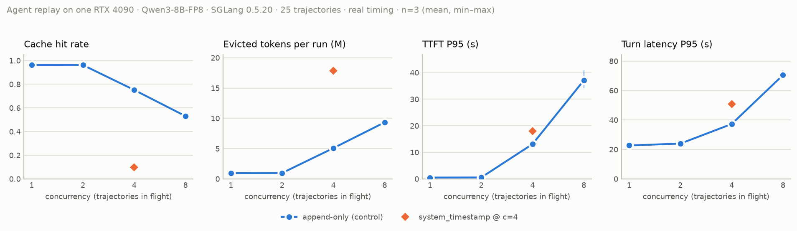

# agent-workload-lab

*[English](README.md) · 中文*

刻画 coding agent 负载对 LLM 推理服务的压力，验证 **harness 侧的上下文组装策略**如何影响 **serving 侧的前缀缓存与调度**。用 [pi](https://github.com/badlogic/pi-mono) 对云端模型录制真实编码会话（一次性），再以可控并发把它们作为负载重放到本地 SGLang，按请求采集 radix cache 命中、TTFT、队列深度与尾延迟。

> harness 在 system prompt 末尾写入当前时间，使 radix cache 命中率从 **0.9633** 降到 **0.1059**，单轮 P95 延迟上升 **7.7%**，TTFT P95 上升 **1078.7%**（507 → 5971 ms）；改为 append-only 组装后恢复到 0.9633。四条会话同飞时，同一个改动让单轮 P95 **+36.7%**、TTFT P50 **+1046%**。修法不是「别给模型时间」，是「别放在前缀里」：同一条时间戳放到 messages 末尾，命中 0.9620；单并发下除 TTFT P50 +9 ms（+3.8%）外，延迟都与 append-only 在噪声内无差异，四并发下各项都在噪声内。

全部数字：单张 RTX 4090 · SGLang 0.5.20 · Qwen3-8B-FP8 · 25 条录制轨迹（每次重放 837 请求）· 每个配置重跑 3 次并报方差。来源：[`experiments/*/report.md`](experiments) 与 [`docs/findings.md`](docs/findings.md)。

## 结果

### 单并发下的四种上下文改写（W3）

<picture>
  <source media="(prefers-color-scheme: dark)" srcset="docs/figures/w3-transforms-dark.png">
  
</picture>

| 改写（相对 append-only 对照） | cache hit | TTFT P95 | 单轮 P95 | prompt tokens |
|---|---|---|---|---|
| append-only（对照） | 0.9633 | 507 ms | 22.8 s | 19.47 M |
| `system_timestamp` — system prompt 末尾写时钟 | **0.1059** | **5971 ms**（+1079%） | 24.6 s（+7.7%） | +0.1% |
| `tools_rotate` — 每请求把工具列表轮转一位 | 0.3150 | 5951 ms（+1074%） | 24.1 s（+5.5%） | ±0 |
| `truncate_tool_results` — 截断旧工具结果 | 0.9102 | 695 ms（+37%） | **21.2 s（−7.1%）** | **−29.2%** |

### 真实轮间时序下的并发扫描（W4）

<picture>
  <source media="(prefers-color-scheme: dark)" srcset="docs/figures/w4-concurrency-dark.png">
  
</picture>

| 同飞会话数 | cache hit | TTFT P50 / P95 / P99 | 单轮 P50 / P95 / P99 | 驱逐 tok/次 | 队列非空 | 超时（≥ 600 s） | wall |
|---|---|---|---|---|---|---|---|
| 1 | 0.9633 | 0.24 / 0.51 / 0.86 s | 2.4 / 22.7 / 39.8 s | 0.96 M | 0% | 0 | 5958 s |
| 2 | 0.9626 | 0.26 / 0.54 / 1.6 s | 2.5 / 24.0 / 41.1 s | 0.97 M | 1.6% | 0 | 3175 s |
| 4 | 0.7520 | 0.43 / **13.1** / 27.8 s | 6.1 / 37.3 / 64.8 s | 5.1 M | 49% | 0 | 2792 s |
| 8 | 0.5309 | 4.7 / 37.1 / 223 s | 10.6 / 70.5 / 231 s | 9.3 M | 82% | **11** | **3237 s** |
| 4 + `system_timestamp` | **0.0981** | 4.9 / 18.1 / 45.8 s | 10.9 / 51.0 / 92.8 s | **17.8 M** | 52% | 0 | 4167 s |

超时请求按右删失下界计入分位，不剔除（见 [decisions](docs/decisions.md)）。c=8 的 P99 CV 14–17%，其余 ≤ 4.8%。

### 后续：修法、并发下的截断、调度策略（W5）

W5 每组只与自带的重跑对照组比较（replayer commit 与 W3/W4 不同）。

| 实验（对各自的对照组） | cache hit | TTFT P50 / P95 / P99 | 单轮 P50 / P95 / P99 | 驱逐 token / run | 超时（≥ 600 s） |
|---|---|---|---|---|---|
| c=1 append-only | 0.9633 | 0.24 / 0.52 / 0.87 s | 2.4 / 23.0 / 40.1 s | 0.96 M | 0 |
| c=1 时间戳放 messages 末尾 | 0.9620 | 0.25 / 0.52 / 0.86 s | 2.4 / 23.0 / 40.2 s | 0.98 M | 0 |
| c=4 append-only | 0.7467 | 0.44 / 14.3 / 34.4 s | 6.1 / 38.3 / 65.1 s | 5.18 M | 0 |
| c=4 时间戳放 messages 末尾 | 0.7688 | 0.41 / 13.7 / 29.8 s | 5.8 / 37.1 / 65.2 s | 4.75 M | 0 |
| c=4 `truncate_tool_results` | **0.8801** | 0.30 / **2.6** / 7.6 s | 3.0 / **27.0** / 48.5 s | 1.90 M | 0 |
| c=8 LPM 调度 | 0.5293 | 4.7 / 36.8 / 249 s | 10.6 / 68.2 / 251 s | 9.11 M | **2 / 5 / 2** |
| c=8 FCFS 调度 | **0.1991** | **18.0** / 51.4 / **66.4** s | 25.6 / 70.5 / **107** s | **15.90 M** | 0 |

c=4 下时间戳放末尾与 append-only 各项都在噪声内（Δ/噪声 ≤ 2.2×）。c=1 对照、c=8 LPM、c=8 FCFS 的驱逐量取自 3 次中的 2 次（冷启动后计数器尚未出现）。

### 数据里不那么显然的几件事

完整版与出处见 [`docs/findings.md`](docs/findings.md)。

1. **过了缓存装得下的并发，再加并发吞吐倒退。** 同样 19.4M prompt token，c=8 比 c=4 多花 16% 墙钟、多 9.3M 驱逐 token 的重复 prefill、丢 11 个请求。
2. **压力几乎全部由前缀驱逐吸收，回撤罕见。** c=4 下每 run 837 个请求里最多回撤 4 个（c=1、c=2 为 0），被回撤的输入 token 只有驱逐量的 0.3–1.6%。*（2026-09-23 更正：旧版写「回撤一次没发生」，读的是每个统计周期清零的 gauge，见 [decisions](docs/decisions.md)。）* agent 每轮在 ~21k 的 prompt 上只出 ~114 个 token，KV 池里塞满的是**空闲会话的缓存前缀**，调度器永远有东西可驱逐。c ≥ 4 时驱逐量 ≈ 未命中量：每次驱逐都是某个活着的会话稍后付一次冷 prefill。
3. **命中率是个糟糕的延迟预测器。** 掉 5 个点伴随单轮 P95 −7%（截断）；掉 21 个点伴随 TTFT P95 +2488%（排队）；再掉 65 个点只多 +38%。该报未命中的 token **量**与队列占用，不是百分比。
4. **截断旧工具结果：单并发下靠 decode 变快，四并发下靠缓存。** c=1 时输出长度相同，TTFT 变差（+37%）而单轮 P95 变好（−7%）。c=4 时符号翻转：命中 0.747 → 0.880、驱逐 −63%、TTFT P95 −82%、单轮 P95 −30%——它同时让 prompt 少了 29%，所以既是活少了、也是缓存更好。
5. **命中率的重跑方差本身是信号。** c=1 三次逐字节相同（std 0.0000），驱逐一开始就漂（c=4 0.0054，c=8 0.0155）。
6. **harness 改动可以离线评估单租户命中率**（按 chat template 算最长公共前缀，三个改写方向全对），**但评估不了并发下的代价**——单轮 P95 从 +7.7% 变成 +36.7%。
7. **LPM 调度饿死可缓存前缀最少的请求；换 FCFS 能消除饥饿，代价是缓存。** c=8 下 LPM 每次都有一条长会话在相邻两轮连续超时，最大 TTFT 382–592 s；FCFS 下没有超时，最大 TTFT ≤ 77 s，TTFT P99 −73%，但命中 0.53 → 0.20、驱逐 +75%、TTFT 中位数变为 3.9 倍。*（被驱逐的会话为何排到队尾，属推断。）*
8. *（推断）* 悬崖在「同飞会话数 × 上下文长度」超过 KV 池的地方（这里 78k token，每会话 ~25k）：2 条没事，4 条出事。

## 仓库内容

```
pi + extension/  ──录制──▶  traces/*.jsonl  ──replay/──▶  单卡 SGLang
                                 │                            │
                          analysis/profile           metrics/ + 每次 run 的 artifact
                          （负载画像）                experiments/<name>/out/<run>/
                                                              │
                                                     analysis/report · analysis/plot
```

| 目录 | 内容 |
|---|---|
| `extension/` | pi extension（TypeScript）：原样记录每次 provider 请求、时序点、工具耗时、轮次边界。只观察不修改。 |
| `replay/` | replayer：轨迹 → 归一化 payload 序列 → 按并发与时序打到 OpenAI 兼容端点；每次 run 落一份自描述 artifact（config、指纹、计划、逐请求日志、指标快照、summary）。被测的上下文改写也在这里。 |
| `metrics/` | SGLang `/metrics` 采样。 |
| `analysis/` | 负载画像、方差/对照报告（指纹不一致或多于一个变量时拒绝对照）、出图。 |
| `experiments/` | 每个实验一个目录：`config.yaml` + 生成的 `report.md` / `compare-*.md`。原始 `out/` 不入库。 |
| `scripts/` | 远端（AutoDL）装配、带指纹的 SGLang 启动、rsync、录制辅助。 |
| `docs/` | [`findings.md`](docs/findings.md) 结论 · [`experiments.md`](docs/experiments.md) 实验日志（含负面结果）· [`decisions.md`](docs/decisions.md) 口径与取舍 · [`recording.md`](docs/recording.md) / [`remote.md`](docs/remote.md) runbook · [`figures/`](docs/figures) |

指标口径（全项目固定，改动记入 `decisions.md`）：

- **前缀缓存命中率** = 命中的 prefill token / 总 prefill token，按请求聚合（来自 `usage.prompt_tokens_details.cached_tokens`，SGLang `--enable-cache-report`）。
- **TTFT** = 请求发出 → 第一个内容 token，含排队。**单轮延迟** = 请求发出 → 流结束。
- 尾延迟一律 P50 / P95 / P99；客户端超时的请求按右删失下界计入。

## 复现

轨迹**不随仓库发布**：里面有第三方仓库的源码与模型输出。它们的 sha256 与形状（请求数、prompt 大小、工具分布）在 [`experiments/profile/meta.json`](experiments/profile/meta.json) 与 [`profile.md`](experiments/profile/profile.md)。复现需要自己录制；其余链路全部脚本化。

本地（无 GPU）：

```bash
uv sync && just test && just lint                 # Python 3.12 + uv；extension 测试需要 Node 20+
bash scripts/record.sh <repo> <case-name>         # 用 pi 录一条轨迹（自备模型与 API key）
just profile                                      # 负载画像 → experiments/profile/out/
just replay-dry w4-c4                             # 不连服务，只构建重放计划
```

远端（一张 24 GB 卡；项目用的是 AutoDL RTX 4090，见 [`docs/remote.md`](docs/remote.md)）：

```bash
cp scripts/remote.env.example scripts/remote.env  # SSH host/port
bash scripts/sync.sh --traces                     # 代码 + traces → 远端
ssh … 'bash scripts/setup.sh'                     # sglang 0.5.20 venv + Qwen3-8B-FP8 权重（幂等）
ssh … 'bash scripts/serve.sh'                     # 起 SGLang 并写环境指纹
ssh … 'nohup bash scripts/run-batch.sh 3 w4-c1 w4-c2 w4-c4 w4-c8 w4-c4-timestamp &'
bash scripts/sync.sh --pull w4-c4                 # artifact → 本地
just report w4-c4 && just compare w4-c4 w4-c1 && just plot
```

每份 artifact 都带环境指纹（GPU、驱动、SGLang 版本与启动参数、模型校验和、pi 版本、replayer commit、trace 校验和）；报告拒绝把不同指纹的 run 放进同一张表。已提交的 54 次 run 的重放墙钟合计约 56 GPU 小时（`experiments/*/report.md` 的 `wall` 行），不含装环境、加载模型与预热。

## 范围与局限

- 一张卡、一个模型、一个 serving 栈、一种 harness。绝对数字不外推；定性结论依赖负载形状（长 prompt、短输出、轮间有间隙），应可迁移但未验证。
- 改写实验（W3）用 compressed 时序，并发扫描（W4）用 real 时序，两张表不直接对比。c=1 下两种时序各分位差 ≤ 1.7%。
- 任务成功率刻意不管：重放用的是小模型，只复现录制会话的 token 序列与时序。
- 未做：c=3、c=8 下更长的客户端超时、KV cache FP8。见 [`docs/later.md`](docs/later.md)。

参与者（人或 agent）的工作约定见 [CLAUDE.md](CLAUDE.md)。许可证：[MIT](LICENSE)。
